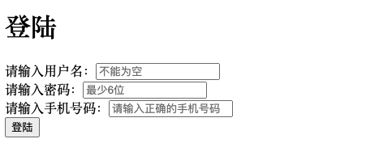

# 使用策略模式实现表单验证

## 1.什么是策略模式


策略模式说起来很高大上，其实现实生活中很常见。比如，你要从老家去北京故宫游玩，可选的出行方式有坐火车、开车自驾、坐飞机等几种方式，
至于选择哪种出现方式要看自己的经济能力和个人需求，而选择的过程就是一种策略模式。

## 2.应用例子-表单验证
在js代码中如何实现策略模式？

- 1.你得有一堆可供选择的策略`strategies = [one, two, three,...]`
- 2.根据不同的场景`Context`使用不同策略。

下面我使用策略模式完成登录界面的表单验证,如果不符合规则，进行弹窗提示



```html
<!DOCTYPE html>
<html lang="en">

<head>
    <meta charset="utf-8" />
    <meta name="viewport" content="width=device-width, initial-scale=1" />
</head>

<body>
    <h1>登陆</h1>
    <form id="registerForm">
        <span>请输入用户名：</span><input type="text" name="userName" placeholder="不能为空"/>
        <br />
        <span>请输入密码：</span><input type="text" name="password" placeholder="最少6位"/>
        <br />
        <span>请输入手机号码：</span><input type="text" name="phoneNumber" placeholder="请输入正确的手机号码"/>
        <br />
        <button>登陆</button>
    </form>
</body>
<script src="./index.js"></script>
</html>
```
### 1.把策略准备好，策略就是校验规则
```js
const strategies = {
    isNoEmpty: function(value, errorMsg) {
        return value ? '' : errorMsg
    },
    minLength: function(value, errorMsg,length) {
        return value && value.length >= length ? '' : errorMsg
    },
    isMoble: function(value, errorMsg) {
        return /(^1[3|5|8][0-9]{9}$)/.test(value) ? '' : errorMsg;
    }
}
```
### 2.再写一个Context
```js
// 校验类
const Validator = function(){
    this.rules = [];// 校验规则
}
// 添加校验规则到校验池
Validator.prototype.add = function(dom, rule, errorMsg){
    const key = Object.keys(rule)[0];
    const value = rule[key]
    this.rules.push(function(){
        // 执行key对应策略
        return strategies[key].apply(null, [dom.value, errorMsg, value])
    })
}
// 执行校验池
Validator.prototype.run = function(){
    for(let i = 0; i < this.rules.length; i ++){
        const msg = this.rules[i]()
        if (msg) return msg;
    }
}
```
### 3.业务代码
```js
// 进行校验
const validateLoginData = function(){
    const validator = new Validator()
    validator.add(document.getElementsByName('userName')[0], {isNoEmpty: true}, '用户名不能为空')
    validator.add(document.getElementsByName('password')[0], {minLength: 6}, '密码最少6位')
    validator.add(document.getElementsByName('phoneNumber')[0], {isMoble: true}, '手机号不正确')
    return validator.run();
}
// 绑定事件
window.onload = function(){
    document.getElementById('registerForm').onsubmit = function(){
        console.log('xxxx')
        var errorMsg = validateLoginData()
        if(errorMsg){
            alert(errorMsg)
            return false;
        }
    }
}
```
